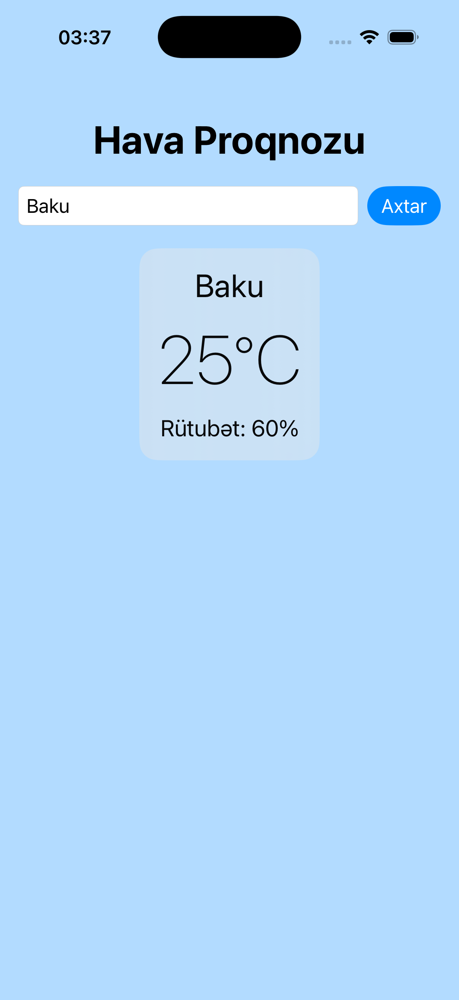

# WeatherApp

A simple iOS app that shows weather info by city name.

  

## Built with

- SwiftUI
- MVVM architecture
- OpenWeatherMap API
- URLSession with async/await
- Codable for JSON parsing
- @Observable for state management
